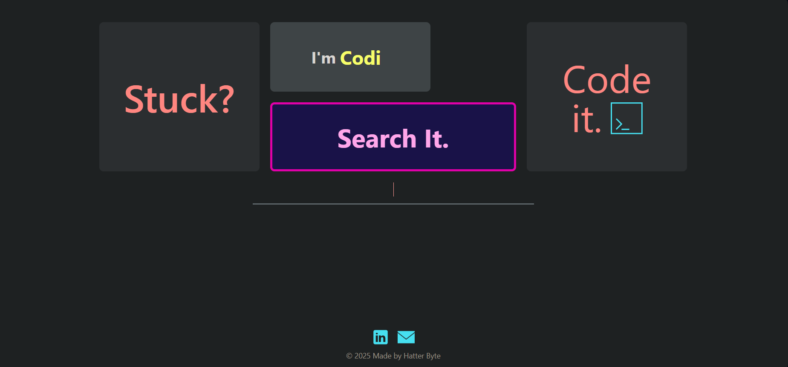
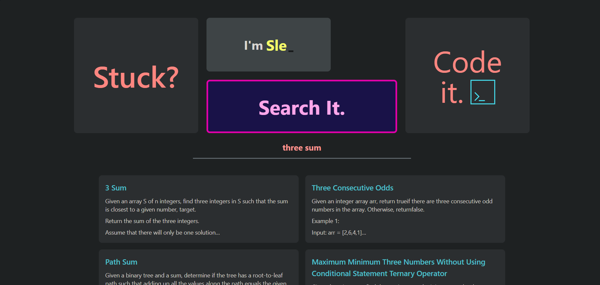
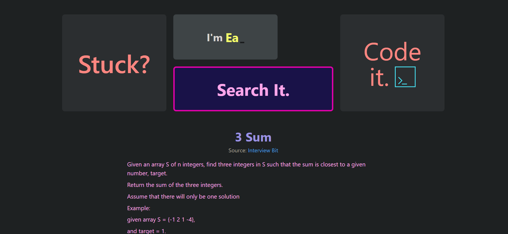

#  Hatter Lab - The Ultimate DSA Search Engine

Hatter Lab is a powerful **DSA (Data Structures & Algorithms) search engine** designed to help programmers find relevant problems efficiently. Built with **React, Node.js, and Vite**, it provides fast and accurate search results using **BM25 ranking, spell-check, lemmatization, and stopword removal**.

##  Features

- **Instant Search** - Find DSA problems quickly with intelligent query processing  
- **BM25 Ranking** - Prioritizes relevant results for better accuracy  
- **Query Optimization** - Includes spell-check, stopword removal & lemmatization  
- **Fast & Responsive UI** - Built with React & TailwindCSS  
- **Cache Mechanism (Planned)** - Optimized search with client-side caching  
- **REST API Architecture** - Smooth backend communication

##  Tech Stack

### **Frontend**

- **React** + **Vite** (Fast development & optimized builds)
- **TailwindCSS** (Modern UI design)
- **React Router** (Navigation handling)

### **Backend**

- **Node.js** + **Express.js** (REST API)
- **BM25 Algorithm** (Search ranking)
- **Redis (Planned)** (Caching for fast searches)
- **MongoDB** (Database for problem storage)

##  How It Works

1. User enters a query in the **search bar**.
2. Query is optimized using **lemmatization, spell-check, and stopword removal**.
3. Search results are ranked using **BM25 ranking**.
4. Results are **cached** to improve performance on repeated queries.
5. Clicking a problem opens a detailed **Problem Page**.

##  Setup & Installation

1️ **Clone the repository**

```sh
 git clone https://github.com/HatterByte/Hatter-Lab
```

2️ **Install dependencies**

```sh
 npm install
 cd frontend && npm install
 cd ../backend && npm install
```

3️ **Set up environment variables**  
Create a `.env` file in `frontend/` and add:

```env
VITE_BACKEND_URL=http://localhost:3000
```

Create a `.env` file in `backend/` and add:

```env
MONGO_URI='<Your MongoDB connection string>'
PORT=3000
FRONTEND_URL=http://localhost:5173
```

4️ **Run the development servers**

```sh
 cd frontend && npm run dev  # Starts the frontend
 cd backend && npm run server      # Starts the backend
```

##  Screenshots

🔹 **Landing Page** - Clean UI with search functionality  



🔹 **Search Results** - Fast and accurate query results  



🔹 **Problem Page** - Detailed problem description



##  To-Do

- [ ] Implement Redux for search result caching
- [ ] Add Redis for backend caching
- [ ] Improve ranking algorithm with ML-based techniques

##  Contributing

Feel free to **fork** this repo, submit **pull requests**, or suggest **new features**! 

##  License

This project is licensed under the **MIT License**.

---

Made with ❤️ by **Hatter Byte** 
